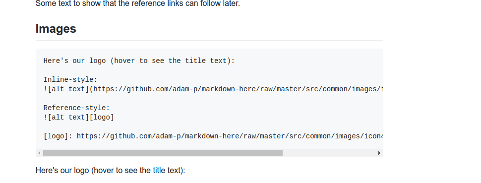

__NEURON Economics__

__Contents__

1. [Introduction](#_r8tbqbursiur)
	
	1.1. [Key assumptions:](#_k8yr2wfdg9b)
	
	1.2. [Business plan milestones:](#_e1drhc9ly629)

2. [Business model description](#_fnothamz19w0)
3. [Branch development table ](#_yjsf9l54phkc)
4. [Licensing plan  ](#_ir8h51do1wbc)
5. [Customer growth ratio](#_gmfxxcmalshv)
6. [Customer growth table](#_6ymir71m8ecj)
7. [Expense structure](#_nkr3bqdp72ey)
8. [Revenue structure](#_w9ev6vxd2iat)
9. [Доходы](#_aqvxc1j6twoe)
10. [Расходы накопительным итогом](#_l0adxokfbr5q)
11. [Доходы накопительным итогом](#_srveyju44fxu)

__NEURON Economics__

#### 1. Introduction

NEURON’s economic model is presented below\.

Необходимо отметить, что предложенный бизнес план был рассчитан на основе фактических данных конкретного банка с региональной сетью из 14 единиц за период 10 месяцев\. Агрегированный бизнес план по годам представлен в Таблице 1

#### 1.1. Ключевые допущения:

1.1.1. Бизнес план, включая комиссионный доход, рассчитан по пессимистическому сценарию;

1.1.2. Динамика развития  происходит планомерно, без резких скачков, но активно;

1.1.3. Появление первых клиентов  \- четвертый квартал 2017 года;

1.1.4. Компания способна показывать прирост количества клиентов в месяц в размере 15%;

1.1.5. Размер среднего чека \- $148,28;

1.1.6. Первоначальное количество клиентов \- 2439 транзакций/месяц;

#### 1.2. Ключевые точки бизнес плана:
 

1.2.1. Открытие офисов присутствия будет происходить в соответствии с планом: Таблица 1;

1.2.2. Территориальное лицензирование будет происходить в соответствии с графиком: Таблица 2;

1.2.3. Прирост клиентов будет происходить по плану: Таблица 4;

1.2.4. Максимальная сумма расходов, накопительным итогом составляет \- 

|   | __\-$23 576__ |
|---|---|
|   | __001,93__ |

__Таблица 9__;

1.2.5. Поступление первой выручки \- 4 кв 2017, __Таблица 7__
1.2.6. Ежемесячная выручка растет с  

| $0,00 | $361 646,27 |
|---|---|

 в 2017 до 

|   | $1 203 725 349,55 |
|---|---|

 в 2022, __Таблица 7__;

1.2.7. Выход на самоокупаемость  \- 4\-й квартал 2019 \(через 2,5 года\), __Таблица 8__;
1.2.8. Выход в прибыль \- 2\-й квартал  2022, __Таблица 10__;
1.2.9. Выход в прибыль означает, что компания полностью погасила за счет прибыли все затраты в сумме 

|   | __\-$23 576__ |
|---|---|
|   | __\-$23 576 001,93__ |

1.2.10. Агрегированный бизнес план по годам, Таблица 1

| __INCOMES__ |  |  __2018__ | __2019__ | __2020__ | __2021__ | __2022__ |
|---|---|---|---|---|---|---|
| Num of clients | Rate | 30 306,91 | 162 149,53 | 867 540,53 | 4 641 558,84 | 8 118 115,41 |
| Комиссия фикс\., выпуск карты $ |  | $60 613,81 | $263 685,25 | $1 410 782,01 | $7 548 036,60 | $6 953 113,16 |
| Комиссия Платформы за переводы |  | $4 493,80 | $24 042,96 | $128 635,83 | $688 233,88 | $1 203 725,35 |
| Комиссия на курсе | $31 456,60 | $168 300,70 | $900 450,83 | $4 817 637,13 | $8 426 077,45 |
| Обслуживание карты/мес |  | $12 122,76 | $64 859,81 | $347 016,21 | $1 856 623,53 | $3 247 246,17 |
| Комиссия за снятие наличных/вывод в фиат |  | $26 962,80 | $144 257,74 | $771 814,99 | $4 129 403,25 | $7 222 352,10 |
| Комиссия на ICO |  | $300 000,00 | $300 000,00 | $300 000,00 | $300 000,00 | $300 000,00 |
| Комиссия Р2Р биржи |  | $4 493,80 | $24 042,96 | $128 635,83 | $688 233,88 | $1 203 725,35 |
|  |  |  |  |  |  |  |
| __Total Incomes__ |  | __$440 143,58__ | __$989 189,41__ | __$3 987 335,71__ | __$20 028 168,27__ | __$28 556 239,57__ |
|  |  |  |  |  |  |  |
| __EXPENSES__ | __2017__ | __2018__ | __2019__ | __2020__ | __2021__ | __2022__ |
| Branches dev exp HR \(incl taxes\) | \-$601 344,00 | \-$601 344,00 | \-$601 344,00 | \-$601 344,00 | \-$651 456,00 | \-$300 672,00 |
| Branches monthly exp | \-$87 000,00 | \-$235 200,00 | \-$250 800,00 | \-$250 800,00 | \-$271 700,00 | \-$125 400,00 |
| Development \(incl taxes\) | \-$434 082,89 | \-$3 175 096,32 | \-$3 175 096,32 | \-$3 175 096,32 | \-$3 439 687,68 | \-$1 587 548,16 |
| Licensing | \-$474 484,00 | \-$387 952,00 | \-$6 000,00 | \-$6 000,00 | \-$6 500,00 | \-$3 000,00 |
| Advert exp | \-$477 054,25 | \-$500 000,00 | \-$600 000,00 | \-$600 000,00 | \-$650 000,00 | \-$300 000,00 |
| __Total expenses__ | __\-$2 073 965,13__ | __\-$4 899 592,32__ | __\-$4 633 240,32__ | __\-$4 633 240,32__ | __\-$5 019 343,68__ | __\-$2 316 620,16__ |
|   |   |   |   |   |   |
| __Операционные расходы__  |   |   |   |   |   |
| Виза комиссии |   | \-$2 246,90 | \-$12 021,48 | \-$64 317,92 | \-$344 116,94 | \-$601 862,67 |
| Комиссии банков контрагентов |   |  \-$17 975,20 | \-$96 171,83 | \-$514 543,33 | \-$2 752 935,50 | \-$4 814 901,40 |
| Расходы по выпуску карт |  | \-$30 306,91 | \-$131 842,62 | \-$705 391,01 | \-$3 774 018,30 | \-$3 476 556,58 |
| __Итого, прочие расходы__ |  | __\-$50 529,01__ | __\-$240 035,93__ | __\-$1 284 252,25__ | __\-$6 871 070,74__ | __\-$8 893 320,65__ |
|   |   |   |   |   |   |
| __Всего расходов__ |  | __\-$7 024 086,46__ | __\-$4 873 276,25__ | __\-$5 917 492,57__ | __\-$11 890 414,42__ | __\-$11 209 940,81__ |
|   |   |   |   |   |   |
| __EBIT__ | \-$2 073 965,13 | __\-$6 583 942,88__ | __\-$3 884 086,84__ | __\-$1 930 156,86__ | __$8 137 753,85__ | __$17 346 298,75__ |
|   |   |   |   |   |   |
| __Налоги__ |  17% | 0 | 0 | 0 | \-$1 383 418,15 | \-$2 948 870,79 |
|   |   |   |   |   |   |
| __Доход после налогообложения__ |  | \-$6 583 942,88 | \-$3 884 086,84 | \-$1 930 156,86 | $6 754 335,69 | $14 397 427,97 |
|   |   |   |   |   |   |
| __Доход к распределению на владельцев токенов__  |  __20%__ |  0 |  0 | 0  |  $1 350 867,14 | $2 879 485,59 |

#### Описание Бизнес модели

Бизнес модель NEURON основана на взимании комиссий за предоставление возможности клиентам платформы Neuronplatform приобретать, пополнять и объединять остатки средств на крипто и фиатных счетах и свободно оперировать объединенными средствами при осуществлении переводов и/или расчетов за товары и услуги\. Возможность покупки и пополнения криптосчетов будет доступна уже при запуске платформы, а с помощью будущей собственной платежной системы NEURON клиенты получат возможность пополнять свои криптокошельки путем перевода фиатных денег на счет платежной системы NEURON и одновременно, аналогичную возможность по переводу средств со своего криптокошелька на свой фиатный счет\. 

Плата за выпуск, обслуживание, комиссии за снятие денежных средств в банкоматах и терминалах выдач по всему миру с использованием пластиковые карт NEURON обеспечат платформе Neuronplatform еще один источник доходов\. 

После получения лицензии EMI и открытия представительств собственной платежной системы в различных регионах мира NEURON обеспечит наличие корсчетов в национальных валютах региона присутствия представительства, что позволит клиентам пополнять фиатные счета, а также осуществлять конвертацию криптовалюта\-фиат\-криптовалюта  без курсовых разниц для каждого региона присутствия\. 

Для расчета бизнес модели проекта были взяты данные по внутренним расходным операциям \(между счетами клиентов банка\), внешним платежам \(операции с клиентами других банков\), а также внешние платежи клиентов, не имеющих банковского счета\. За основу расчёта была взята выборка фактических платежей за период, соответствующий 10 месяцам\. В целях повышения прогностической точности расчётов данные были усреднены\.

__Структура доходов__

Доходы платформы складываются из следующих элементов:

| __Комиссии__ | __Фиксированные__ | __Процентные__ |
|---|---|---|
| Средний чек | $148,28 |  |
| Комиссия разовая за выпуск карты | 10,00 | 1,48% |
| Комиссия за переводы по счетам |  | 0,50% |
| Комиссия на курсе |  | 3,50% |
| Обслуживание карты/мес | 2,00 | 0,30% |
| Комиссия за снятие наличных/вывод в фиат |  | 3,00% |
| Комиссия на ICO |  | 5,00% |
| Комиссия Р2Р биржи |  | 1,00% |
| Комиссия Мерчант аккаунтов |  | 0,50% |
| __Итого доходность платформы__ |  | __15,28%__ |
|   |   |   |

Величина среднего чека была взята на основе анализа расходных операций по счетам клиентов с активными счетами, по которым за рассматриваемый период осуществлялась хотя бы одна операция\. Показатель среднего чека определялся путем деления суммы расходных операций всех клиентов за 10 месяцев на их количество\.

Для проверки результатов был произведен расчет дохода, получаемого с одного клиента\. Расчет был сделан на основании данных об оборотах по доходным счетам баланса банка \(на доходных счетах учитывались суммы комиссий, полученных от операций клиентов\) за 10 месяцев\. Показатель дохода с одного клиента определялся путем деления суммы доходов от комиссий, полученных за указанный период, на количество клиентов \- владельцев счетов, фактически уплативших все установленные комиссии\. 

#### 3. Таблица развития офисной сети

Развитие регионов присутствия будет идти в соответствии с планом лицензирования и обусловлено необходимостью наличия собственных корсчетов в этих странах для интеграции фиатных счетов с криптосчетами клиентов\.  Это даст возможность обслуживать счета внутри разрабатываемой платежной системы\. Результатом будет являться удешевление платежных операций\. Наличие офисов в регионах присутствия будет необходимым параметрам и отнесено нами на дальнейшие этапы развития с возможностью финансирования за счет прибыли компании\.

#### 4. График лицензирования

Лицензирование состоит из расходов, связанных с процессами государственного регулирования, и привязано к общей лицензии EMI\. Получение лицензии не требует дополнительных расходов кроме перечисленных в таблице с некоторыми допущениями в зависимости от региона\.

| __License API application investments__ |   |
|-----------------------------------------|---|
| Annual supervisory fee | $3 360,00 |
| Company establishment | $560,00 |
| State duty for a license | $1 008,00 |
| Legal fees | $33 600,00 |
| Additional expenses \(translation, notary fees\) | $896,00 |
| Application documents preparation | $33 600,00 |
| Opening of two safeguarding accounts \* | $8 960,00 |
| Total for licensing | __$81 984,00__ |

#### 5. Динамика роста клиентов

Данные по изменению количества клиентов и темпа их прироста взяты из реального платежного бизнеса в фиатной валюте с периодом один год и усреднены по месяцам\. Принимая во внимание рост динамики пользователей криптовалют за последние пол года в мире, есть  основание полагать, что указанные показатели будут легко достигнуты\.

#### 6. Таблица роста количества клиентов

В таблице приведены данные по предполагаемому приросту количества клиентов в разбивке по регионам\.

#### 7. Структура расходов

В таблице указаны процентные соотношение видов расходов в общем объеме всех расходов\.

| __EXPENSES__ |   |
|---|---|
| Branches dev exp HR | 12,05% |
| Branches monthly exp | 4,38% |
| Development| 53,77% |
| Licensing | 3,17% |
| Advert exp | 11,22% |
| Liquidity support | 9,81% |
| Сustomer's support fund | 5,60% |
| Bounty & bugs | 1,41% |
| Bonuses | 18,91% |
| Founders | 14,13% |
| Advisors & Consultants | 2,52% |

#### 8. Структура доходов

Структура доходов платформы достаточно диверсифицирована и находится в рыночных диапазонах, что позволяет говорить о конкурентоспособности\. Наличие значительной доли фиксированных доходов свидетельствует об относительной независимости доходов платформы от оборотов по счетам клиентов\. Присутствие в структуре доходов комиссии за проведение ICO  снижает зависимость доходной части платформы от комиссий за платежные сервисы\. Ниже указаны виды доходов и их процентное соотношение к общему объему доходов платформы\.

|  __Комиссии__ |   |
|---|---|
| Комиссия фикс\., $  | 29,81%  |
|  Комиссия Платформы за переводы | 3,72%  |
| Комиссия на курсе  |  26,01% |
|  Комиссия на пластике | 5,96%  |
|  Комиссия РКО | 0,00%  |
| Комиссия за снятие наличных/вывод в фиат  | 11,15%  |
|  Комиссия на ICO | 15,19%  |
| Комиссия Р2Р биржи  | 7,43%  |
|  Комиссия Мерчант аккаунтов | 0,74%  |

#### 

#### 9. Выручка

Выручка указана помесячно и основана на цифрах, приведенных в п\.2

#### 10. Доходы

#### 11. Расходы накопительным итогом

#### 12. Доходы накопительным итогом

